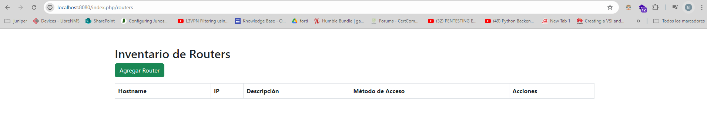

# Tarea CODEIGNITER 4

Este proyecto es una aplicación CRUD (Crear, Leer, Actualizar, Eliminar) construida con CodeIgniter 4. Permite gestionar contactos en una base de datos utilizando una interfaz web sencilla.

## Descripción del Proyecto

La aplicación CRUD permite a los usuarios realizar las siguientes operaciones:

- **Agregar Contactos:** Crear nuevos registros de contactos con detalles como nombre, correo electrónico y teléfono.
- **Ver Contactos:** Consultar y listar todos los contactos almacenados en la base de datos.
- **Editar Contactos:** Modificar los datos de contactos existentes.
- **Eliminar Contactos:** Eliminar contactos del sistema.

## Ejecucion.

   

